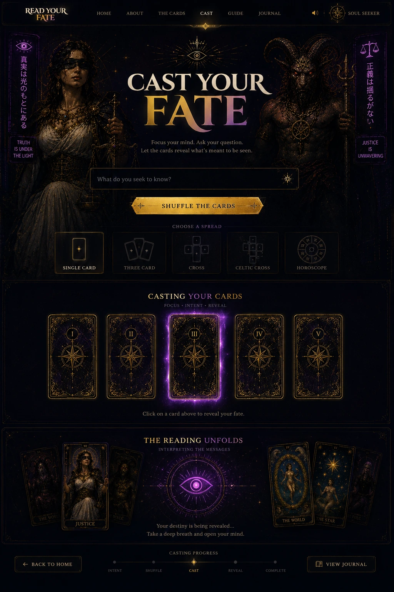

# ARCANA - Night City Tarot


A cyberpunk-inspired Major Arcana tarot experience built as a zero-dependency static web application. Drawing inspiration from the atmosphere and symbolism of Night City, ARCANA combines traditional tarot archetypes with futuristic design, immersive visual effects, and interactive card readings.

## Overview

ARCANA is a client-side tarot experience designed to feel like a relic recovered from the dark corners of a neon-soaked metropolis. The project blends mystical symbolism with cyberpunk aesthetics, creating an interactive experience where users can explore the Major Arcana, receive personalized readings, and uncover their fate through a visually rich interface.

Built entirely with HTML, CSS, and JavaScript, the application requires no build tools, frameworks, or external dependencies.

## Features

- Interactive Major Arcana tarot readings
- Single-card draw experience
- Three-card spread readings for Past, Present, and Future
- Dynamic reading modal with detailed interpretations
- Atmospheric cyberpunk visual design
- Animated rain, particles, scan lines, and ambient effects
- Mouse-driven parallax interactions
- Responsive design for desktop and mobile devices
- Zero-dependency architecture

## Technology Stack

- HTML5
- CSS3
- Vanilla JavaScript
- Canvas API
- Intersection Observer API

## Project Structure

```text
/
├── index.html
├── styles.css
├── game.js
└── cards/
```

## Getting Started

Clone the repository and open the project locally.

```bash
git clone <repository-url>
cd arcana
```

Run a local development server:

```bash
python -m http.server 8080
```

Then open:

```text
http://localhost:8080
```

## Design Philosophy

ARCANA was designed around the contrast between ancient mysticism and advanced technology. Traditional tarot symbolism is reinterpreted through the lens of a dystopian future, combining:

- Neon lighting
- Futuristic interfaces
- Atmospheric visual storytelling
- Corporate and urban iconography
- Japanese-inspired typography
- Cinematic motion design

The result is an experience that feels equally mystical and digital.

## Architecture

The application follows a simple client-side architecture:

- Card data is stored in structured JavaScript objects.
- The interface is generated dynamically from the card dataset.
- Readings are rendered through reusable modal components.
- Animations are handled through a combination of CSS and JavaScript.
- All assets are served statically without a backend.

## Browser Support

ARCANA targets modern browsers and supports:

- Chrome
- Edge
- Firefox
- Safari

Internet Explorer is not supported.

## Inspiration

The project was inspired by the atmosphere, visual storytelling, and tarot symbolism found throughout the Cyberpunk 2077 universe, particularly the iconic tarot readings associated with Night City's spiritual culture.

## License

This project is available for educational, portfolio, and personal use.

---

Created with a passion for interactive storytelling, creative development, and immersive web experiences.
