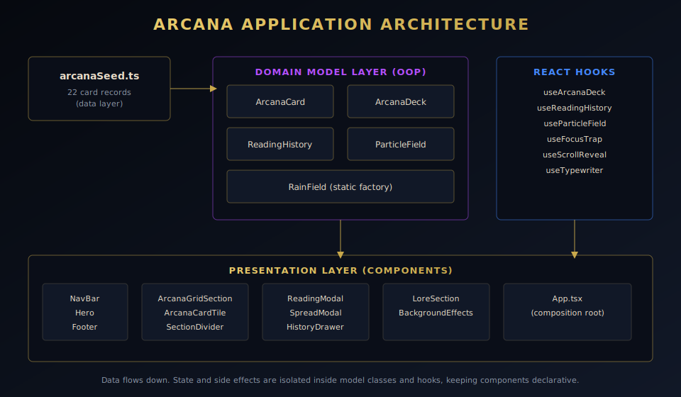
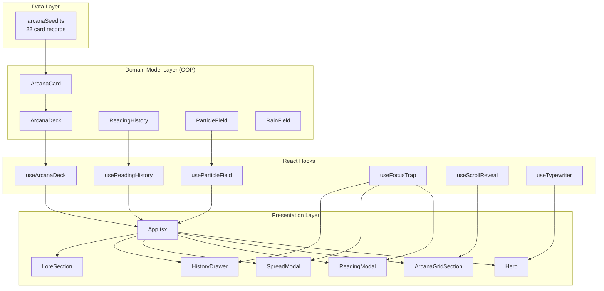
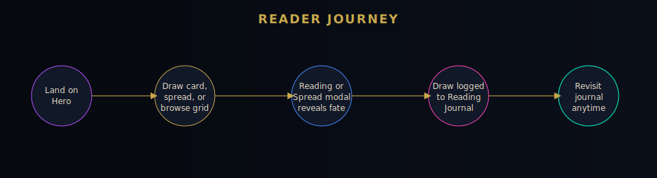
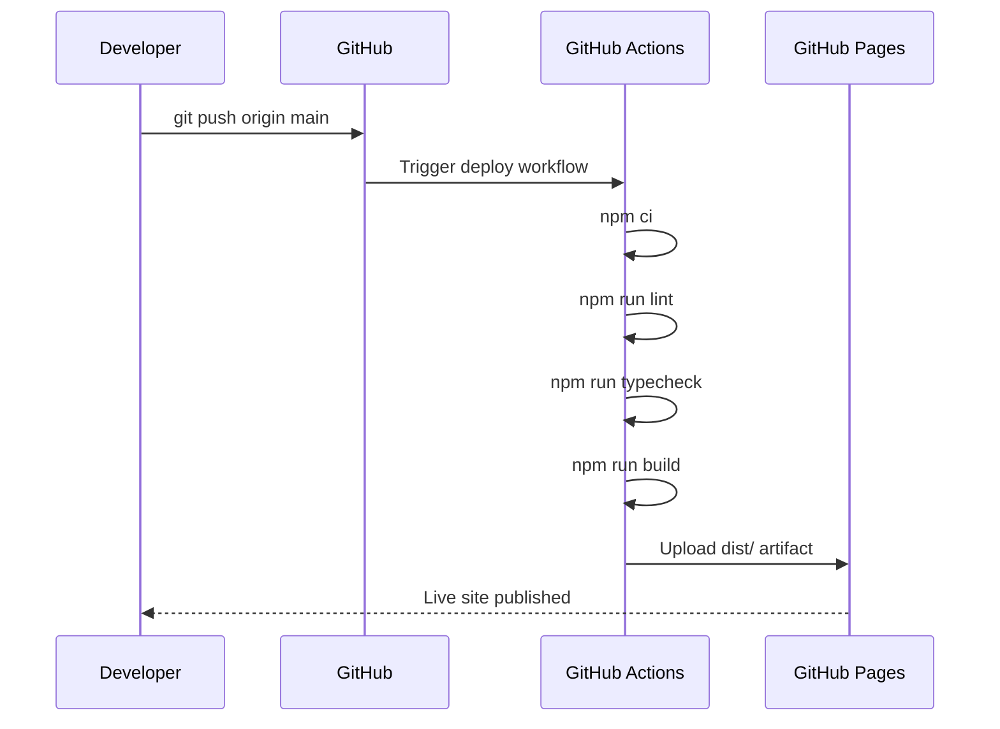

<div align="center">


# ARCANA | Night City Divination

**A cyberpunk tarot divination experience, rebuilt in React, TypeScript, and object oriented domain models.**

[](.github/workflows/deploy.yml)
[](https://react.dev)
[](https://www.typescriptlang.org)
[](https://vitejs.dev)
[](LICENSE)

</div>

---

## Overview

ARCANA is a Major Arcana tarot reader set in the neon soaked streets of Night City. Visitors draw a single card, pull a three card past, present, future spread, or browse the full 22 card codex, each one delivered as an in universe oracle transmission.

This repository is a full migration of the original static HTML, CSS, and vanilla JavaScript site into a **TypeScript, React, object oriented** codebase, engineered for a clean production deployment on **GitHub Pages** through **GitHub Actions**.

<div align="center">

</div>

---

## Table of Contents

- [Feature Highlights](#feature-highlights)
- [What Changed From the Original Site](#what-changed-from-the-original-site)
- [Architecture](#architecture)
- [Reader Journey](#reader-journey)
- [Project Structure](#project-structure)
- [Getting Started](#getting-started)
- [Available Scripts](#available-scripts)
- [Deployment](#deployment)
- [Accessibility](#accessibility)
- [Tech Stack](#tech-stack)
- [License](#license)

---

## Feature Highlights

| Feature | Description |
|---|---|
| 🃏 Single Card Draw | Weighted random draw that avoids repeating the last few cards pulled in a session |
| 🔮 Three Card Spread | Past, present, future layout with a synthesized narrative summary |
| 🌓 Upright and Reversed Orientation | Every draw resolves to an orientation, each with its own oracle meaning |
| 📅 Card of the Day | A deterministic daily card, seeded from the calendar date, shown on the hero |
| 📜 Reading Journal | A persisted history drawer that logs every draw to `localStorage`, with clear controls |
| 🔎 Codex Search and Filter | Filter the 22 card grid by Light, Shadow, or Power path, or search by keyword |
| ♿ Accessible Modals | Focus trapping, Escape to close, ARIA roles, and full reduced motion support |
| 🎨 Ambient Cyberpunk FX | Rain, particle field, scanlines, film grain, and parallax city skyline, all class encapsulated |

---

## What Changed From the Original Site

The original repository shipped a single `index.html`, a 1,500 line `styles.css`, and a 550 line `game.js` file that mixed DOM queries, animation timers, and tarot data in one procedural script.

This migration preserves every visual detail and every line of oracle copy, and restructures the logic as follows:

- **Object oriented domain models.** `ArcanaCard`, `ArcanaDeck`, `ReadingHistory`, `ParticleField`, and `RainField` are TypeScript classes that own their own state and behavior, instead of loose functions operating on global arrays.
- **React component tree.** Every DOM section from the original site (nav, hero, arcana grid, reading modal, spread modal, lore, footer) is now an isolated, typed component.
- **Custom hooks bridge models into React.** `useArcanaDeck`, `useReadingHistory`, `useParticleField`, `useFocusTrap`, `useScrollReveal`, and `useTypewriter` connect the class based models to React's render cycle without leaking imperative DOM code into components.
- **New capabilities layered in**, listed above in [Feature Highlights](#feature-highlights), none of which existed in the original vanilla build.
- **Continuous deployment.** A GitHub Actions workflow lints, type checks, builds, and deploys straight to GitHub Pages on every push to `main`.

---

## Architecture

The codebase follows a strict one way data flow: seed data feeds the domain model layer, hooks adapt those models for React, and components stay purely declarative.



### Design principles

1. **Single responsibility classes.** `ArcanaDeck` only knows how to filter, search, and draw cards. `ReadingHistory` only knows how to persist and recall a journal. Neither knows anything about React.
2. **Encapsulated side effects.** Canvas animation (`ParticleField`) and `localStorage` access (`ReadingHistory`) are wrapped entirely inside their owning class, so no component ever touches the browser APIs directly.
3. **Typed contracts everywhere.** Every model, hook, and component is fully typed, including discriminated unions for card orientation and spread position keys.

---

## Reader Journey

<div align="center">

</div>

---

## Project Structure

```text
arcana/
├── .github/
│   └── workflows/
│       └── deploy.yml          # CI/CD pipeline: lint, typecheck, build, deploy
├── docs/
│   └── diagrams/                # Source SVG diagrams used in this README
├── public/
│   ├── assets/                  # Banner art and favicon
│   └── cards/                   # All 22 Major Arcana card illustrations
├── src/
│   ├── components/
│   │   ├── arcana/              # Grid, filter, search, and card tile
│   │   ├── hero/                # Hero section and showcase cards
│   │   ├── history/             # Reading journal drawer
│   │   ├── layout/               # Ambient background effects
│   │   ├── lore/                # Misty's Parlour lore section
│   │   ├── nav/                  # Site navigation bar
│   │   ├── reading/              # Single card reading modal
│   │   └── spread/               # Three card spread modal
│   ├── data/
│   │   └── arcanaSeed.ts         # Raw tarot data, ported from the original game.js
│   ├── hooks/                    # useArcanaDeck, useReadingHistory, useFocusTrap, etc
│   ├── models/                   # ArcanaCard, ArcanaDeck, ReadingHistory, ParticleField, RainField
│   ├── styles/                   # base.css (ported) and enhancements.css (new features)
│   ├── App.tsx                   # Composition root
│   ├── main.tsx                  # React entry point
│   └── vite-env.d.ts
├── index.html
├── package.json
├── tsconfig.json
├── vite.config.ts
└── README.md
```

---

## Getting Started

### Prerequisites

- Node.js 20 or newer
- npm 10 or newer

### Installation

```bash
git clone https://github.com/<your-username>/<your-repo>.git
cd <your-repo>
npm install
```

### Local development

```bash
npm run dev
```

Vite starts a local dev server, by default at `http://localhost:5173`, with instant hot module reloading.

### Production build

```bash
npm run build
npm run preview
```

`npm run build` type checks the project with `tsc -b` and then bundles the site into `dist/`, ready for static hosting. `npm run preview` serves that build locally so you can verify it before deploying.

---

## Available Scripts

| Script | Purpose |
|---|---|
| `npm run dev` | Start the Vite development server with hot reload |
| `npm run build` | Type check and produce a production bundle in `dist/` |
| `npm run preview` | Serve the production bundle locally |
| `npm run lint` | Run ESLint across the TypeScript and TSX source |
| `npm run typecheck` | Run the TypeScript compiler in no emit mode |
| `npm run format` | Format the codebase with Prettier |

---

## Deployment

This repository deploys automatically to **GitHub Pages** using the workflow defined in [`.github/workflows/deploy.yml`](.github/workflows/deploy.yml).



### One time repository setup

1. Push this project to a GitHub repository.
2. In the repository, open **Settings → Pages**.
3. Under **Build and deployment**, set **Source** to **GitHub Actions**.
4. Push to `main`. The workflow builds and publishes automatically.

The Vite base path is set to `./` in `vite.config.ts`, so the build works correctly whether the site is served from a root domain or a project subpath such as `https://<username>.github.io/<repo-name>/`.

---

## Accessibility

- All modals (`ReadingModal`, `SpreadModal`, `HistoryDrawer`) trap keyboard focus, restore focus on close, and close on `Escape`.
- Every ambient decorative layer is marked `aria-hidden`.
- The entire experience honors `prefers-reduced-motion`, disabling animation and the typewriter effect for visitors who request it.
- Interactive elements are real `<button>` elements with descriptive `aria-label` values rather than clickable `<div>` elements.

---

## Tech Stack

- **React 18** with functional components and hooks
- **TypeScript 5** in strict mode, including project references
- **Vite 5** for development and production bundling
- **ESLint** and **Prettier** for code quality and formatting
- **GitHub Actions** and **GitHub Pages** for continuous deployment

---

## License

Released under the [MIT License](LICENSE).

<div align="center">

*運命システム v2.0.77 · © 2077 ARCANA CORP*

</div>
